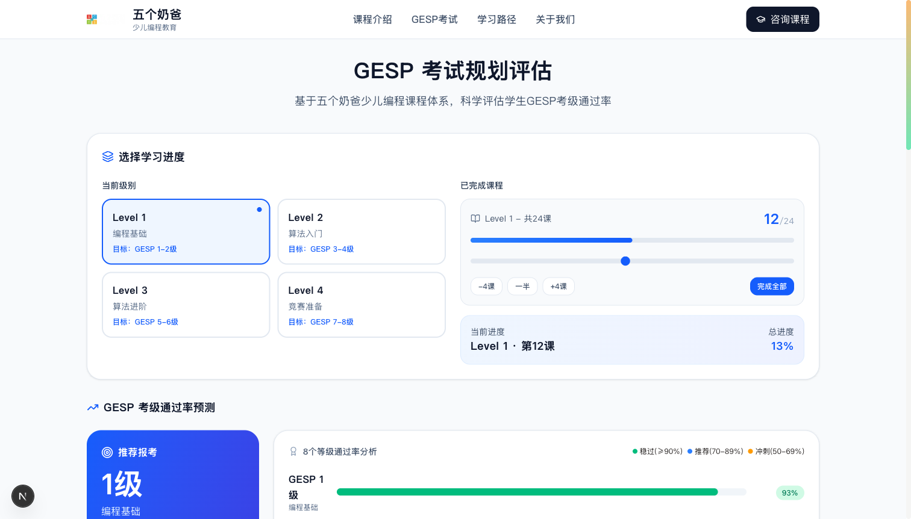

# GESP 考试规划网站 - 设计评审报告

**评审日期**: 2026-03-19  
**评审人**: Claude Code (前端设计技能驱动)  
**评审方法**: 基于前端设计技能的系统性清单评审

---

## 📸 当前设计截图



---

## 1. UI设计 / 视觉系统评审

### ❌ 严重问题

| 问题 | 说明 | 影响 |
|------|------|------|
| **AI Slop 配色** | 橙(#FF9F43) + 蓝(#54A0FF) + 绿(#1DD1A1) + 渐变，典型的生成式AI网站配色 | 没有品牌独特性，看起来像通用SaaS模板 |
| **商务图标系统** | 使用 Lucide 的 `BarChart3`、`Target`、`BookOpen` 等商务图标 | 与少儿编程品牌调性严重不符 |
| **渐变滥用** | "GESP 考试规划评估"标题使用渐变文字，多处卡片使用渐变背景 | 典型的AI生成网站特征，缺乏品味 |
| **无字体系统** | 完全使用系统默认字体，没有针对儿童教育选择合适字体 | 缺乏亲和力和趣味性 |

### ⚠️ 次要问题

| 问题 | 说明 |
|------|------|
| 圆角不统一 | 有的卡片 `rounded-3xl`，有的按钮 `rounded-lg` |
| 阴影过于普通 | 使用默认的 `shadow-lg` 等Tailwind预设，没有定制 |
| 色彩对比度问题 | 蓝色背景上的白色文字在某些显示器上可能可读性不足 |

---

## 2. 布局与视觉层次评审

### ❌ 严重问题

| 问题 | 说明 | 影响 |
|------|------|------|
| **过度对称布局** | 所有内容严格居中，四张卡片等宽排列 | 缺乏视觉动感和趣味性，像企业Dashboard |
| **卡片堆砌** | 四个大白卡片垂直堆叠（选择进度→通过率→知识点→学习路径） | 信息过载，没有重点层次 |
| **8级通过率全部展示** | GESP 1-8级全部平铺展示，占用大量空间 | 视觉混乱，用户难以快速获取关键信息 |
| **无视觉焦点** | 页面没有清晰的视觉入口点 | 用户不知道首先关注什么 |

### 当前布局分析

```
┌─────────────────────────────────────┐
│  Header (Logo + 导航 + 咨询按钮)      │  ← 标准企业header
├─────────────────────────────────────┤
│  "GESP 考试规划评估" (渐变标题)        │  ← 居中大标题
│  副标题说明                           │  ← 灰色小字
├─────────────────────────────────────┤
│  ┌─────────────────────────────┐    │
│  │  选择学习进度 (大白卡片)       │    │  ← 卡片1
│  │  [Level 1] [Level 2]         │    │
│  │  [Level 3] [Level 4]         │    │
│  │  [=======Slider=======]      │    │
│  └─────────────────────────────┘    │
├─────────────────────────────────────┤
│  ┌─────────────────────────────┐    │
│  │  GESP 考级通过率预测 (大白卡片) │    │  ← 卡片2
│  │  [推荐报考 1级 93%]          │    │
│  │  [GESP1 ▓▓▓▓▓▓▓▓ 93%]        │    │
│  │  [GESP2 ░░░░░░░░ 11%]        │    │
│  │  ... (重复8次)               │    │
│  └─────────────────────────────┘    │
├─────────────────────────────────────┤
│  ┌─────────────────────────────┐    │
│  │  知识点掌握分析 (大白卡片)     │    │  ← 卡片3
│  │  [基础] [语法] [运算]...      │    │
│  └─────────────────────────────┘    │
├─────────────────────────────────────┤
│  ┌─────────────────────────────┐    │
│  │  学习路径规划 (大白卡片)       │    │  ← 卡片4
│  │  [Level 1] [Level 2]         │    │
│  │  [Level 3] [Level 4]         │    │
│  └─────────────────────────────┘    │
├─────────────────────────────────────┤
│  Footer                              │
└─────────────────────────────────────┘
```

**问题**：这个布局完全是从功能性出发的，没有考虑儿童/家长用户的心理模型。

---

## 3. 内容与文案评审

### ❌ 严重问题

| 问题 | 当前文案 | 问题分析 |
|------|----------|----------|
| **标题过于正式** | "GESP 考试规划评估" | 像政府公文，不像儿童教育产品 |
| **冰冷的进度** | "13%" 灰色小字 | 缺少正向激励，应该庆祝已完成的部分 |
| **功能性标签** | "稳过" "推荐" "冲刺" | 虽然功能性OK，但缺少温度和鼓励 |
| **无品牌故事** | 完全没有"五个奶爸"的故事 | 浪费了品牌名的亲和力 |

### 当前文案示例

```
❌ "基于五个奶爸少儿编程课程体系，科学评估学生GESP考级通过率"
   → 太正式、太学术、太冰冷

❌ "稳过(≥90%) 推荐(70-89%) 冲刺(50-69%) 准备中(<50%)"
   → 像考试评分标准，不像学习伙伴的鼓励

❌ "预测说明：通过率基于课程知识点的覆盖程度计算"
   → 技术性过强，家长可能不关心这些
```

---

## 4. 动效与交互评审

### ❌ 严重问题

| 问题 | 说明 | 期望 |
|------|------|------|
| **进度变化无反馈** | 拖动滑块时只有数字变化 | 应该有角色反应、庆祝动画 |
| **卡片悬停平淡** | 只有轻微的阴影加深 | 应该有趣味性的微交互 |
| **无完成反馈** | 达到100%时没有特殊效果 | 应该有 confetti、角色欢呼 |
| **缺少趣味性** | 完全没有游戏化元素 | 应该像 Duolingo 一样有趣 |

### 动效现状

- 进度条：`transition-all duration-500` 线性过渡
- 卡片悬停：`hover:shadow-lg` 阴影加深
- 按钮悬停：`hover:bg-orange-600` 颜色加深

**结论**：所有动效都是为了"看起来现代"，而非服务于儿童教育体验。

---

## 5. 儿童教育适配性评估

### 评分卡

| 维度 | 1-5分 | 说明 |
|------|-------|------|
| **可爱度** | ⭐⭐☆☆☆ (2/5) | 完全不可爱，像企业报表 |
| **亲和力** | ⭐⭐⭐☆☆ (3/5) | 暖色调有一定亲和力但被商务感抵消 |
| **趣味性** | ⭐☆☆☆☆ (1/5) | 没有游戏化、没有趣味元素 |
| **儿童友好** | ⭐⭐☆☆☆ (2/5) | 不吸引儿童，也不让家长感到温馨 |
| **品牌一致性** | ⭐⭐☆☆☆ (2/5) | 浪费了"五个奶爸"的品牌潜力 |

### 用户画像匹配度

**目标用户**: 6-15岁学习编程的儿童 + 焦虑孩子教育的家长

| 用户需求 | 当前设计匹配度 |
|----------|----------------|
| 孩子想要有趣的学习体验 | ❌ 完全不匹配 |
| 家长想要清晰的学习路径 | ✅ 基本满足 |
| 家长想要可信赖的品牌 | ⚠️ 太像模板，缺乏专业感 |
| 孩子想要成就感 | ❌ 冰冷的数字展示 |
| 家长想要了解GESP考试 | ✅ 信息完整 |

---

## 6. 竞品对比分析

### 当前设计 vs 优秀儿童教育产品

| 维度 | 当前设计 | Scratch | 编程猫 | 核桃编程 |
|------|----------|---------|--------|----------|
| **主色调** | 商务橙+蓝 | 鲜艳多彩 | 活泼粉蓝 | 明亮黄绿 |
| **角色IP** | ❌ 无 | ✅ 猫咪 | ✅ 猫咪 | ✅ 核桃形象 |
| **形状语言** | 圆角矩形 | 有机形状 | 圆润可爱 | 圆润活泼 |
| **动效风格** | 商务过渡 | 弹跳活泼 | 萌系动画 | 游戏化反馈 |
| **进度展示** | 冰冷百分比 | 解锁成就 | 收集元素 | 等级成长 |

### 当前设计 vs "五个奶爸"品牌

| 品牌名潜力 | 当前设计实现 |
|------------|--------------|
| "五个" → 可以用5个角色代表5个阶段 | ❌ 完全没有 |
| "奶爸" → 温暖、可靠、有耐心、陪伴成长 | ❌ 完全没有体现 |
| "少儿编程" → 趣味、科技、未来 | ⚠️ 只有"科技"，没有"趣味" |

---

## 7. 核心设计问题总结

### 🔴 致命问题 (必须修复)

1. **配色是AI Slop的典型代表** - 橙蓝绿+渐变组合被过度使用，没有品牌独特性
2. **布局是企业Dashboard** - 完全不适合儿童教育产品
3. **没有品牌IP视觉化** - 浪费了"五个奶爸"的品牌资产
4. **缺少情感化设计** - 没有庆祝、没有鼓励、没有成就感

### 🟡 严重问题 (强烈建议修复)

5. **文案过于正式** - 像政府文件，不像教育伙伴
6. **图标系统错误** - 商务图标与品牌调性不符
7. **信息架构混乱** - 8级通过率全部展示，重点不突出
8. **动效无趣** - 没有游戏化反馈，没有微交互

### 🟢 次要问题 (可以改进)

9. 圆角和阴影不统一
10. 字体选择保守
11. 响应式布局可以优化

---

## 8. 改进方向建议

### 🎨 视觉方向重塑

**新色彩系统**:
```
主色: 奶油黄/蜂蜜色 #FFD93D (像奶爸的温柔)
辅助色: 薄荷绿 #6BCB77 (编程的科技感)
点缀色: 柔和粉彩系列
背景: 奶油白 #FFFDF5
```

**新形状语言**:
- 用有机blob形状代替圆角矩形
- 引入手绘风格的装饰元素
- 卡片使用"云朵""对话框"等有趣形状

**新字体系统**:
- 标题：圆润的中文字体（如"站酷快乐体"）
- 正文：清晰的 rounded sans-serif

**角色IP设计**:
- 设计5个"奶爸"卡通形象
- 每个Level由不同的"奶爸"引导
- 用角色表情反馈学习进度

### 📐 布局重构建议

**故事化布局**:
```
┌─────────────────────────────────────┐
│  [5个奶爸Logo - 温暖手绘风格]          │
├─────────────────────────────────────┤
│  "嘿！我是大奶爸，让我帮你规划        │
│   GESP考试吧！" [角色对话框]          │
├─────────────────────────────────────┤
│  [选择你的学习进度 - 游戏化界面]        │
│  ┌────┐ ┌────┐ ┌────┐ ┌────┐       │
│  │Lvl1│ │Lvl2│ │Lvl3│ │Lvl4│ ← 角色头像 │
│  └────┘ └────┘ └────┘ └────┘       │
├─────────────────────────────────────┤
│  [第12课完成！] ← 大🎉庆祝动画        │
│  小奶爸："你已经掌握14个知识点了！"    │
├─────────────────────────────────────┤
│  [GESP考试能力评估 - 游戏化展示]        │
│  [🟢 1级 - 稳过！] [🟡 2级 - 加油！]   │
│  (只展示相关等级，其他折叠)            │
├─────────────────────────────────────┤
│  [知识点收集册 - 像宝可梦图鉴]          │
│  [基础 💡x1] [语法 💡x4] ...          │
├─────────────────────────────────────┤
│  [学习路径地图 - 像冒险游戏地图]        │
│   🏁 Level 1 → Level 2 → ...        │
└─────────────────────────────────────┘
```

### ✨ 交互优化建议

| 场景 | 当前 | 建议 |
|------|------|------|
| 拖动滑块 | 数字变化 | 角色眼睛跟随滑块移动，到达里程碑时欢呼 |
| 完成一课 | 数字+1 | 弹出"获得新知识！"，展示收集到的知识点卡片 |
| 达到50% | 无反馈 | 二奶爸出现："你已经完成一半了！真棒！" |
| 达到100% | 无反馈 | 五奶爸一起庆祝 + confetti 动画 |
| 通过率变化 | 数字变化 | 进度条像血条一样动态增长，有音效反馈 |

---

## 9. 评审结论

### 一句话总结

> **当前设计是一个功能性正确但情感性完全缺失的网站。** 它完成了"展示GESP通过率"的任务，但完全没有体现"五个奶爸少儿编程"品牌的温暖，也没有考虑儿童教育产品的趣味性要求。

### 关键数据

| 指标 | 评分 | 说明 |
|------|------|------|
| **视觉独特性** | 2/10 | 典型的AI生成网站外观 |
| **品牌一致性** | 2/10 | 与"五个奶爸"品牌完全不匹配 |
| **儿童友好度** | 2/10 | 不适合目标用户群体 |
| **功能性** | 8/10 | 功能完整，逻辑清晰 |
| **情感连接** | 1/10 | 完全冰冷的体验 |

### 推荐行动

1. **立即执行**: 重新设计色彩系统，抛弃橙蓝绿渐变组合
2. **高优先级**: 设计"五个奶爸"角色IP并融入界面
3. **高优先级**: 重构布局，打破对称，引入故事化设计
4. **中优先级**: 重写文案，增加温度和鼓励
5. **中优先级**: 添加游戏化动效和微交互

### 参考灵感

- **Duolingo**: 游戏化学习体验、角色IP、庆祝动画
- **Scratch**: 明亮的色彩、有机形状、儿童友好
- **Headspace**: 温暖的设计语言、柔和的色彩、友好的角色
- **Animal Crossing**: 温馨的氛围、收集元素、渐进式解锁

---

**评审完成** ✨

下一步行动建议：使用 `audit` 和 `polish` 技能对当前设计进行系统性优化。
